# Git for Agile Coaches
> Understanding version control — no engineering degree required

---

# Section 1 — Git Fundamentals

---

## 1.1 — The Problem Git Solves

Without version control, teams overwrite each other's work and lose history. Git keeps a complete, safe record of every change ever made.

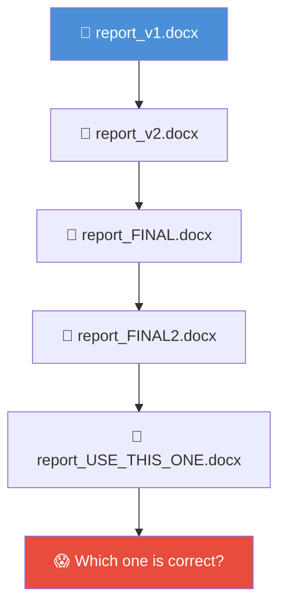

**✏️ Exercise**
```bash
# Browse your repo on GitHub or GitLab
# Click any file → click "History"
# You can see every change ever made, by whom, when
# No command needed — just explore!
```

---

## 1.2 — What is Git? What is a Repository?

Git is a tool that runs on your computer and tracks changes to files over time. A repository (repo) is the project folder Git watches — it stores the full history of every change, like a filing cabinet that never forgets.

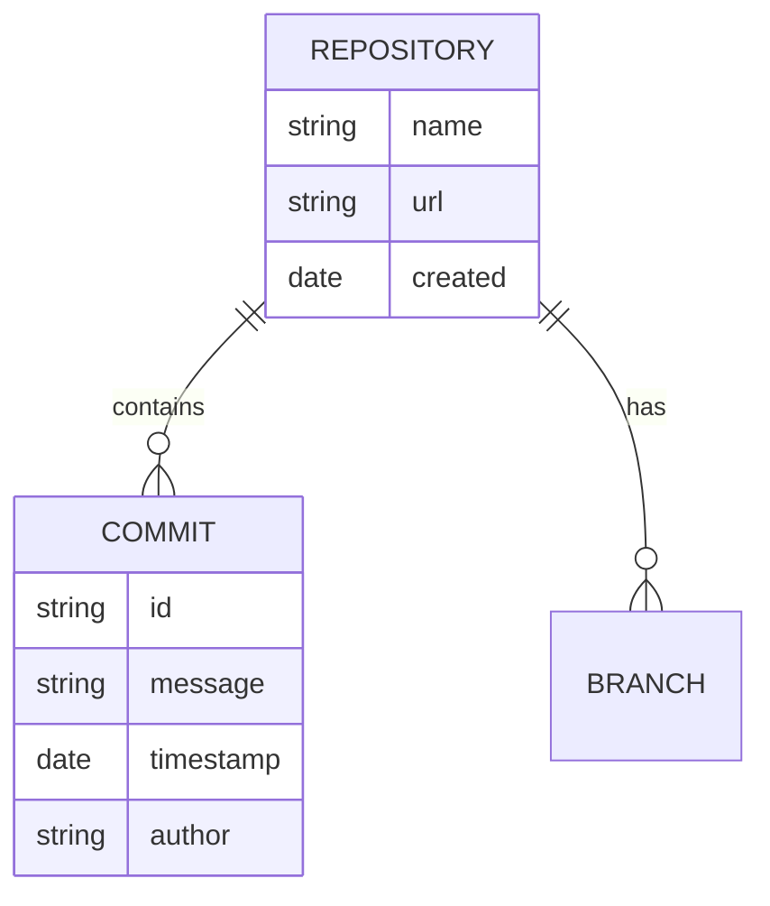

**✏️ Exercise**
```bash
cd /path/to/YOUR-REPO
git log --oneline
# Each line is one saved snapshot of the project
```

---

## 1.3 — Cloning: Getting a Copy of the Repo

Cloning means downloading the entire repository — all files and their full history — from the remote server to your machine. You only do this once per machine.

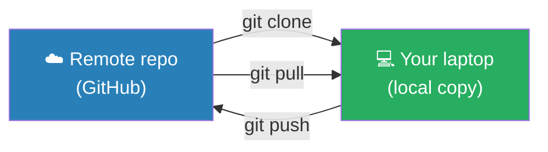

**✏️ Exercise**
```bash
# Clone a repo to your machine (do this once)
git clone https://github.com/YOUR-ORG/YOUR-REPO.git

# Then enter the folder
cd YOUR-REPO
```

---

## 1.4 — What is a Commit? How is it Different From Saving?

Saving a file just updates it on disk — the previous version is gone. A commit is a permanent, labelled snapshot that Git keeps forever. You can always go back to any commit.

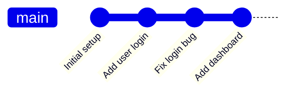

**✏️ Exercise**
```bash
cd /path/to/YOUR-REPO
git log --oneline -5
# Each line = one commit (short ID + message)
# The top = most recent
```

---

## 1.5 — What is a Branch? Why Not Work on `main`?

A branch is an independent copy of the codebase where you work safely without affecting the main version. `main` is the "official" version — you don't edit it directly so it always stays stable and usable.

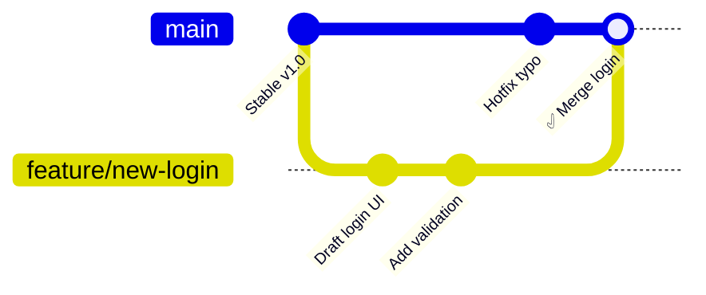

**✏️ Exercise**
```bash
cd /path/to/YOUR-REPO
git branch -a
# * = your current branch
# Lines starting with remotes/ = branches on GitHub
```

---

## 1.6 — Push and Pull: Syncing With the Team

`git pull` downloads the team's latest changes to your machine. `git push` uploads your commits to the shared repo. Think: pull = reading the shared doc for updates, push = saving your edits back.

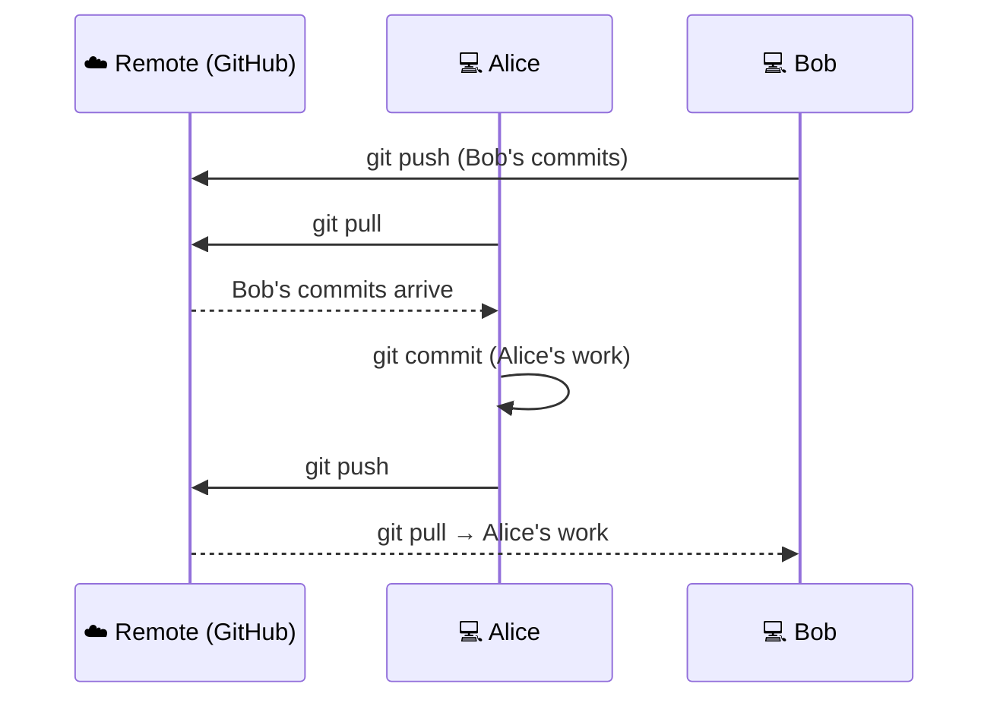

**✏️ Exercise**
```bash
cd /path/to/YOUR-REPO
git pull origin main
# You'll see a list of what changed (or "Already up to date")
```

---

## 1.7 — Merge Conflicts: When Two Edits Clash

A conflict happens when two people edited the same line of the same file. Git can't auto-decide which version wins — a human must choose.

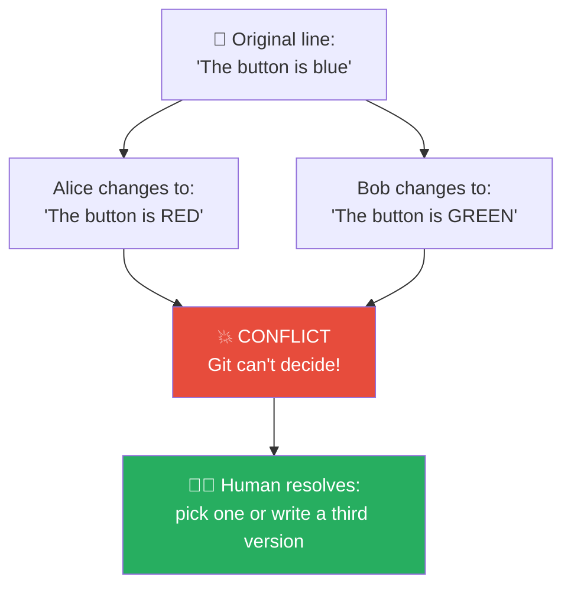

**✏️ Exercise**
```bash
cd /path/to/YOUR-REPO
git status
# Files showing "both modified" = conflict
# Open them and look for <<<< ==== >>>> markers
```

---

## 1.8 — What Tool Do I Use?

All three tools talk to the same Git underneath — they're just different interfaces. Use whichever feels natural; there is no wrong answer.

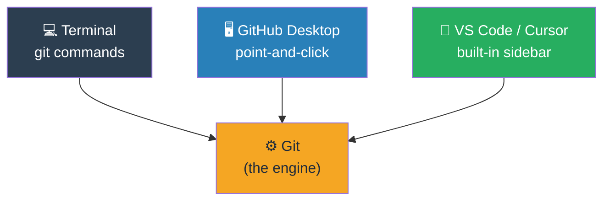

| Tool | Best for |
|------|----------|
| **Terminal** | Full control, any command |
| **GitHub Desktop** | Visual, drag-and-drop simplicity |
| **VS Code / Cursor** | Staying in your editor |

---

# Section 2 — Git & GitHub: How They Relate

---

## 2.1 — Git vs. GitHub: Not the Same Thing

Git is the version-control engine installed on your computer. GitHub is a website that hosts a shared copy of your repo in the cloud. You can use Git without GitHub — but GitHub is useless without Git.

```mermaid
venn
    title Git vs GitHub
    "Git (local)" : "tracks changes", "commits", "branches", "merge", "history"
    "GitHub (cloud)" : "Pull Requests", "Issues", "Actions (CI/CD)", "Teams & permissions", "Web UI"
    "both" : "repository", "branches", "push / pull", "tags"
```

> 💡 **Analogy:** Git is Microsoft Word's track-changes feature. GitHub is SharePoint — the place you put the document so the whole team can access it.

---

## 2.2 — The Lifecycle: Local ↔ Remote

Every action has a direction. Understanding the direction prevents most beginner mistakes.

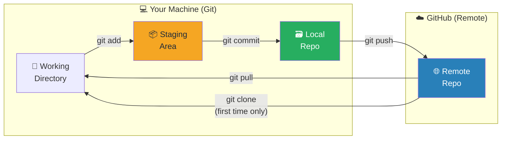

**✏️ Exercise**
```bash
cd /path/to/YOUR-REPO
git remote -v
# Shows the GitHub URL your local repo is connected to
# "origin" = the default name for the remote
```

---

# Section 3 — The Staging Area & Commits

---

## 3.1 — The Staging Area (`git add`)

Before saving, you "stage" the files you want to include — like placing items in a box before sealing it. Only staged files go into the commit.

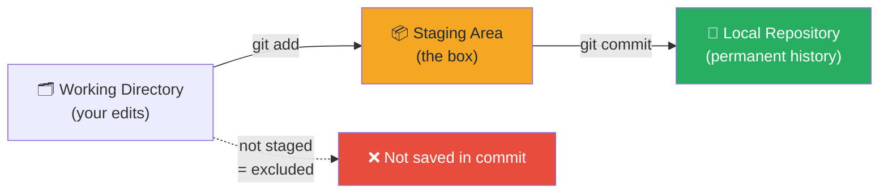

**✏️ Exercise**
```bash
cd /path/to/YOUR-REPO
git status
# Green = staged  |  Red = modified but not staged
```

---

## 3.2 — Switching Branches (`git switch`)

Switching branches changes which timeline you're on. Your folder's files instantly update to reflect that branch — like stepping into a parallel universe.

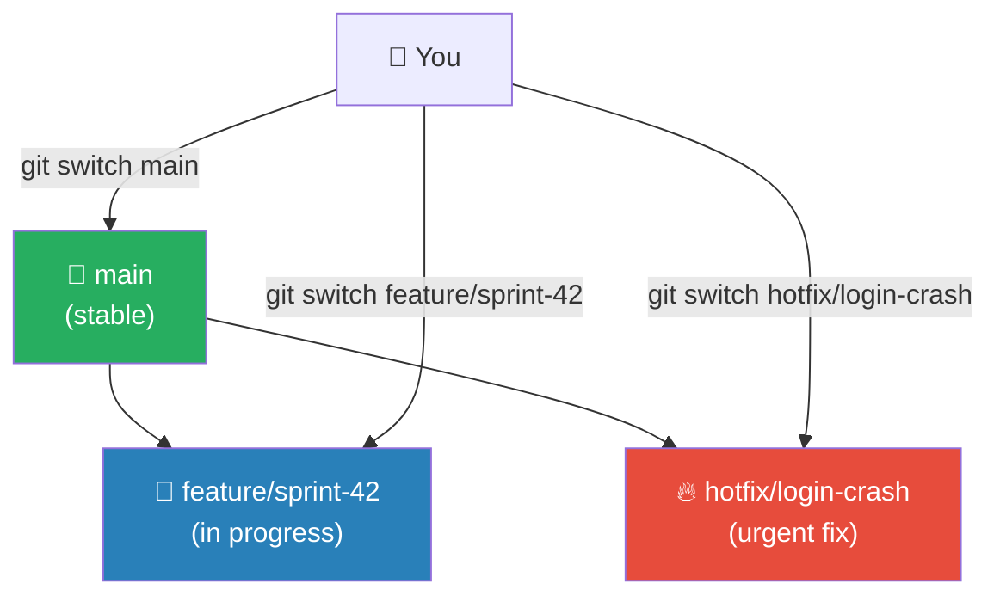

**✏️ Exercise**
```bash
git switch NAME-OF-BRANCH
# Replace NAME-OF-BRANCH with any branch from: git branch -a
```

---

## 🛠️ Hands-On Exercise — Full Publishing Workflow

This exercise walks through the complete journey: create a branch → make a change → commit → push → open a PR.

**Scenario:** You want to add a new `agile-retrospective` skill to the shared repo.

---

**Step 1 — Get the latest version of `main`**
```bash
cd /path/to/YOUR-REPO
git switch main
git pull origin main
```

---

**Step 2 — Create your branch**

Branch naming convention: `feat/<skill-name>` or `update/<skill-name>`
```bash
git switch -c feat/agile-retrospective
# -c = "create"
# You're now on your new branch
```

---

**Step 3 — Create your skill file**
```bash
mkdir -p skills/agile-retrospective
# Create your SKILL.md file here (in your editor)
```

---

**Step 4 — Stage your new file**
```bash
git add skills/agile-retrospective/SKILL.md
git status
# You should see the file in green under "Changes to be committed"
```

---

**Step 5 — Commit with a clear message**

Good format: `feat: add agile-retrospective skill`
```bash
git commit -m "feat: add agile-retrospective skill"
```

---

**Step 6 — Push your branch to GitHub**
```bash
git push origin feat/agile-retrospective
# GitHub will print a URL to open a PR directly — click it!
```

---

**Step 7 — Open the Pull Request on GitHub**

Go to your repo on GitHub. You'll see a yellow banner:
> *"feat/agile-retrospective had recent pushes — Compare & pull request"*

Click it. Fill in:
- **Title:** `feat: add agile-retrospective skill`
- **Description:** What does this skill do? Why is it needed?
- **Reviewer:** Assign a teammate

---

**Step 8 — After your PR is merged**
```bash
git switch main
git pull origin main
# Your skill is now in main 🎉
git branch -d feat/agile-retrospective
# Clean up your local branch
```

---

# Section 4 — Pull Requests & GitHub Review Process

---

## 4.1 — What is a Pull Request?

A Pull Request (PR) is a formal proposal to merge your branch into `main`. It's the place where your teammates see your changes, leave comments, and approve before anything enters the shared codebase. Think of it as a Definition of Done checkpoint.

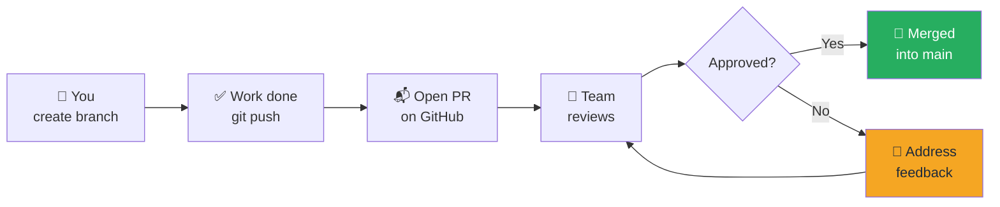

---

## 4.2 — PR Lifecycle: Creation to Merge

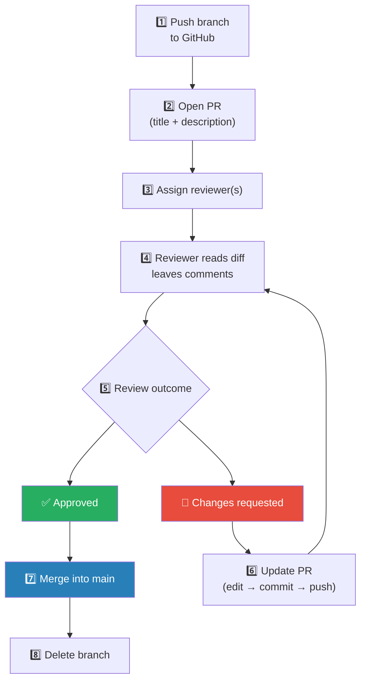

---

## 4.3 — PR Statuses at a Glance

| Status | What it means |
|--------|---------------|
| 🟡 **Open** | PR is live, waiting for review |
| 🔴 **Changes requested** | Reviewer asked for edits before approving |
| 🟢 **Approved** | At least one reviewer gave the green light |
| 🟣 **Merged** | Branch was merged into `main`, PR closed |
| ⚫ **Closed** | PR was abandoned without merging |

---

## 4.4 — Responding to Review Comments

When a reviewer leaves a comment, you have three options:

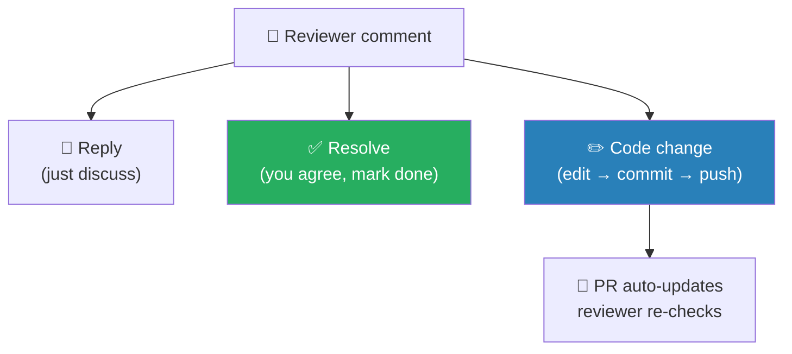

> 💡 You never need to close and reopen a PR. Just push new commits to the same branch — the PR updates automatically.

**✏️ Exercise — Updating your PR after feedback**
```bash
# Make your edits in your editor, then:
git add .
git commit -m "fix: address review comments"
git push origin feat/YOUR-BRANCH
# The PR on GitHub updates instantly
```

---

## 4.5 — Approve vs. Request Changes

- **Approve** → Reviewer is happy. If all required approvals are met, the PR can be merged.
- **Request changes** → Reviewer found something to fix. The PR is blocked until the author addresses it and the reviewer re-approves.
- **Comment** → Reviewer left a note but didn't block or approve.

> 🏛️ **Who can merge?** That's a team decision set in GitHub's branch protection rules. Common options: author merges after approval, or only the reviewer merges.

---

# Section 5 — Merging Strategies

---

## 5.1 — Three Ways to Merge

GitHub offers three merge strategies. They all land the same code in `main` — they differ in what the history looks like afterwards.

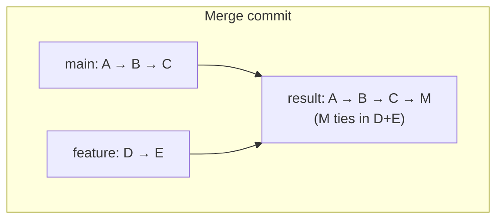

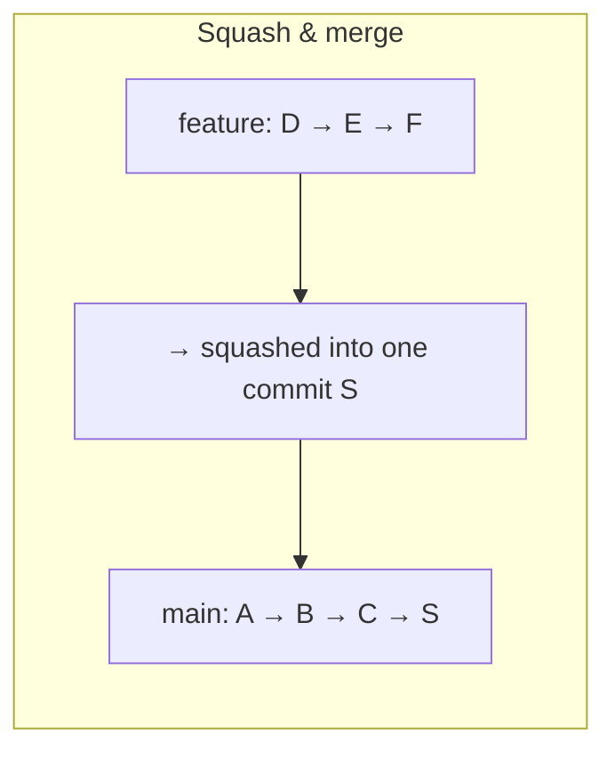

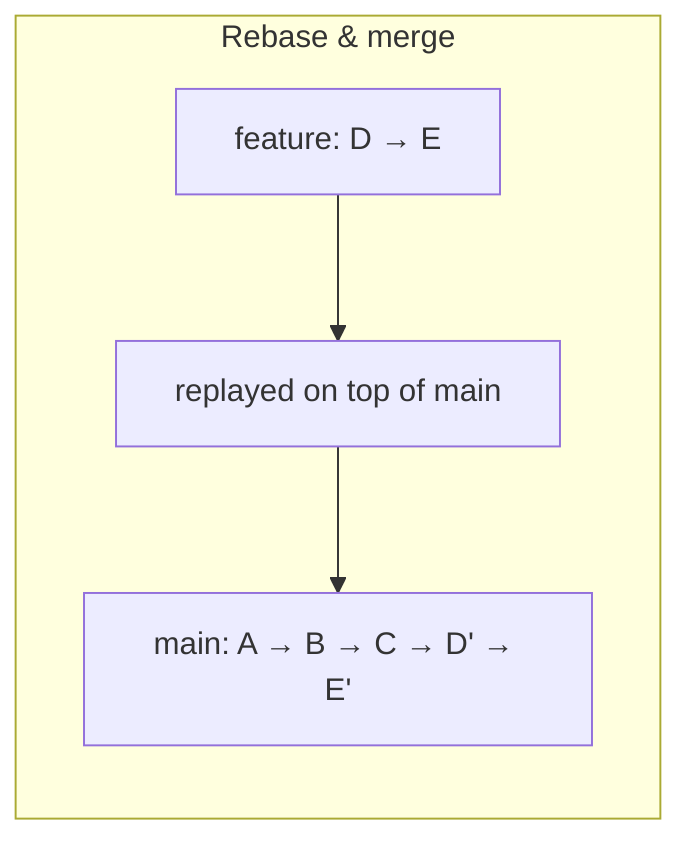

| Strategy | History | Best for |
|----------|---------|----------|
| **Merge commit** | Full branch visible | Auditing who worked on what |
| **Squash & merge** | One clean commit | Small features, keeps history tidy |
| **Rebase & merge** | Linear, no merge commit | Teams who prefer a clean linear log |

> 💡 **Recommendation for this team:** Squash & merge keeps `main`'s history readable — one commit per feature or fix.

**✏️ Exercise**
```bash
# After your PR is merged, verify your change is in main:
git switch main
git pull origin main
git log --oneline -5
# Your squashed commit should be at the top
```

---

## 5.2 — What Happens to My Branch After Merging?

The branch still exists after merging — Git doesn't auto-delete it. It's safe (and good hygiene) to delete it.

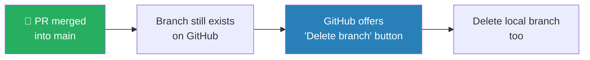

**✏️ Exercise**
```bash
# Delete the remote branch (or click the button on GitHub)
git push origin --delete feat/YOUR-BRANCH

# Delete your local copy
git branch -d feat/YOUR-BRANCH
```

---

# Section 6 — Getting the Latest Version

---

## 6.1 — How Do I Update My Local Copy?

Your local repo doesn't update automatically. You need to explicitly ask Git to fetch and apply the team's latest changes.

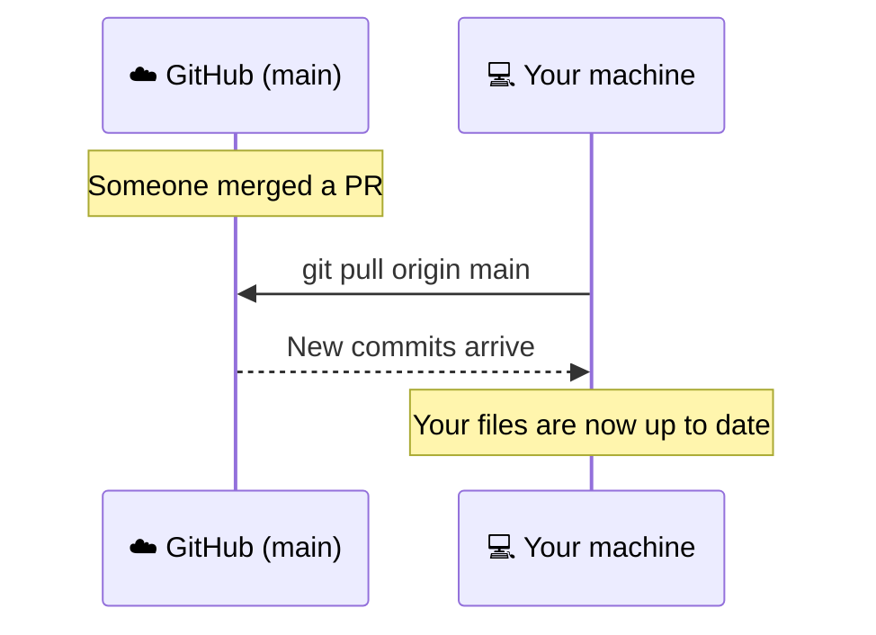

**✏️ Exercise**
```bash
git switch main
git pull origin main
# Output shows which files changed, or "Already up to date"
```

---

## 6.2 — What If I Forgot to Pull Before Making Changes?

You made edits, then realized `main` moved on without you. Git will refuse to push if your branch is behind. The fix: pull first, resolve any conflicts, then push.

```mermaid
flowchart TD
    A["You commit local changes"]
    B["Try to push"]
    C["❌ GitHub rejects push\n'Your branch is behind'"]
    D["git pull origin main"]
    E{"Any conflicts?"}
    F["✅ No conflict\nauto-merged"]
    G["⚠️ Conflict\nresolve manually"]
    H["git push — now works"]

    A --> B --> C --> D --> E
    E -- No --> F --> H
    E -- Yes --> G --> H

    style C fill:#E74C3C,color:#fff
    style F fill:#27AE60,color:#fff
    style G fill:#F5A623,color:#1E2A3A
```

**✏️ Exercise**
```bash
# If your push is rejected, run:
git pull origin main
# Fix any conflicts shown by git status, then:
git push origin YOUR-BRANCH
```

---

## 6.3 — How Do I See the History of a Specific File?

Sometimes you want to know who changed a particular skill file and when — without digging through the entire project history.

```mermaid
flowchart LR
    A["📄 skills/retro/SKILL.md"]
    A --> B["git log -- skills/retro/SKILL.md"]
    B --> C["Commit a3f91b2 — Alice — 'fix: update instructions'"]
    B --> D["Commit b7e32c1 — Bob — 'feat: add retro skill'"]

    style A fill:#2980B9,color:#fff
```

**✏️ Exercise**
```bash
# History of one specific file
git log --oneline -- path/to/YOUR-FILE.md

# See exactly what changed in that file at a specific commit
git show COMMIT-ID -- path/to/YOUR-FILE.md
```

> You can also do this on GitHub: navigate to the file → click **History** in the top-right corner.

---

# Section 7 — Editing Locally Without Pushing

---

## 7.1 — What Happens If I Edit Locally Without Pushing?

Local changes stay local — they don't affect anyone else until you push. This is your safe sandbox.

```mermaid
flowchart LR
    subgraph "💻 Your machine only"
        A["📝 You edit a file"]
        B["git commit"]
        C["Local commits\n(invisible to team)"]
        A --> B --> C
    end

    subgraph "☁️ GitHub (shared)"
        D["main branch\nunchanged"]
    end

    C -. "NOT pushed\n= team can't see it" .-> D

    style C fill:#F5A623,color:#1E2A3A
    style D fill:#27AE60,color:#fff
```

> 💡 **You can experiment freely.** Nothing breaks for anyone else until you explicitly `git push`.

**✏️ Exercise**
```bash
# See your unpushed commits
git log origin/main..HEAD --oneline
# Empty = nothing unpushed. Lines = commits only you have.
```

---

## 7.2 — What If Someone Else Published a New Version While I Was Working?

Your local branch and `main` have diverged. You have commits they don't have, and they have commits you don't have.

```mermaid
flowchart TD
    A["Common starting point\ncommit C"]
    B["Your local: C → D → E\n(your edits)"]
    C["GitHub main: C → F → G\n(team's changes)"]
    A --> B
    A --> C
    B --> D["git pull → merge or rebase\nbring both timelines together"]
    C --> D

    style D fill:#2980B9,color:#fff
```

**✏️ Exercise**
```bash
# Get the team's changes and merge them into your branch
git pull origin main
# If conflicts appear: fix them, then git add + git commit
```

---

## 7.3 — How Do I Get Back to the Official Version?

You made local experiments and want to discard them and return to what's in `main`.

```mermaid
flowchart TD
    A["😬 Local mess\n(experiments gone wrong)"]
    B{"What did you do?"}
    C["Changed files\nbut not committed"]
    D["Made local commits\nnot yet pushed"]
    E["git restore .\n(discard all edits)"]
    F["git reset HEAD~1\n(undo last commit,\nkeep the edits)"]
    G["✅ Clean state\nback to official"]

    A --> B
    B --> C --> E --> G
    B --> D --> F --> G

    style G fill:#27AE60,color:#fff
    style E fill:#E74C3C,color:#fff
    style F fill:#F5A623,color:#1E2A3A
```

**✏️ Exercise**
```bash
# Discard all uncommitted edits (⚠️ irreversible)
git restore .

# Undo your last commit but keep the file edits
git reset HEAD~1
```

---

## 7.4 — Can I Keep My Local Tweak AND Get the Latest?

Yes. Commit your work on a branch first, then pull. Your work is safe on your branch; the pull only updates `main`.

```mermaid
flowchart TD
    A["You have local edits"]
    B["git switch -c experiment/my-tweak"]
    C["git add . && git commit -m 'wip: local experiment'"]
    D["git switch main"]
    E["git pull origin main"]
    F["✅ main is up to date\nYour tweak is safe on its branch"]

    A --> B --> C --> D --> E --> F

    style F fill:#27AE60,color:#fff
```

**✏️ Exercise**
```bash
git switch -c experiment/my-tweak
git add .
git commit -m "wip: local experiment"
git switch main
git pull origin main
```

---

# Section 8 — Versioning in GitHub

---

## 8.1 — How Git Provides Versioning Automatically

Every commit is implicitly a version. Git's history *is* your version history — you never lose a state the team committed to.

```mermaid
gitGraph
    commit id: "Initial skill catalog"
    commit id: "Add retro skill"
    commit id: "Fix retro instructions" tag: "v1.0"
    commit id: "Add estimation skill"
    commit id: "Update retro skill"
    commit id: "Add standup skill" tag: "v1.1"
    commit id: "Hotfix retro typo" tag: "v1.1.1"
```

---

## 8.2 — Tags: Marking Official Releases

A tag is a permanent label pinned to a specific commit. Unlike branch names, tags never move. Use them to mark stable, published versions of your skill catalog.

```mermaid
flowchart LR
    A["commit a3f91b"]
    B["commit b7e32c"]
    C["commit c19d4e"]
    D["commit d84f12"]

    A --> B --> C --> D

    B --- T1["🏷️ v1.0\n(tag)"]
    D --- T2["🏷️ v1.1\n(tag)"]

    style T1 fill:#F5A623,color:#1E2A3A
    style T2 fill:#F5A623,color:#1E2A3A
```

**✏️ Exercise**
```bash
# List all tags
git tag

# Create a new tag on the current commit
git tag v1.1

# Push the tag to GitHub
git push origin v1.1
```

---

## 8.3 — GitHub Releases: Versioning With Context

A GitHub Release wraps a tag with human-readable release notes — a changelog entry, a description of what changed, and optionally downloadable files. It's the public-facing version of a tag.

```mermaid
flowchart TD
    A["🏷️ Git Tag\n(technical marker)"]
    B["📦 GitHub Release\n= tag + release notes + assets"]
    C["📋 Release notes:\n- What's new\n- What changed\n- Breaking changes"]

    A --> B
    B --> C

    style B fill:#2980B9,color:#fff
    style A fill:#F5A623,color:#1E2A3A
```

> **On GitHub:** Go to your repo → **Releases** → **Draft a new release** → pick your tag → write your notes → **Publish release**

---

## 8.4 — Seeing the History of a Specific Skill

```mermaid
flowchart LR
    A["📄 skills/retro/SKILL.md"]
    B["Who changed it?\nWhen? Why?"]
    C["git log --follow\n-- path/to/file"]
    D["GitHub UI:\nfile → History button"]

    A --> B
    B --> C
    B --> D

    style A fill:#2980B9,color:#fff
```

**✏️ Exercise**
```bash
# Full history of one file, with diffs
git log -p -- path/to/YOUR-SKILL.md

# Or on GitHub: navigate to the file → click "History" (top right)
```

---

# Section 9 — Key Concepts Recap

---

## 9.1 — Git Glossary at a Glance

| Term | What it is |
|------|-----------|
| **Repo** | The project folder Git watches |
| **Clone** | Download the full repo to your machine (once) |
| **Commit** | A permanent, labelled snapshot of your changes |
| **Branch** | An independent parallel timeline |
| **Merge** | Combining two branches into one |
| **Pull** | Download team changes to your machine |
| **Push** | Upload your commits to the shared repo |
| **PR** | Formal request to merge + code review |
| **Conflict** | Two edits clash — a human must resolve |
| **Tag** | A permanent label marking a specific version |
| **Release** | A tag + human-readable changelog on GitHub |
| **Remote** | The shared cloud copy (GitHub) |

---

## 9.2 — Git vs. Agile: The Analogy Map

```mermaid
flowchart LR
    subgraph "🏃 Agile World"
        A1["Product Backlog\n(main branch)"]
        A2["Sprint branch\n(feature branch)"]
        A3["Definition of Done\n(PR approval)"]
        A4["Sprint Review\n(code review)"]
        A5["Release\n(tag / GitHub Release)"]
        A6["Audit Trail\n(git log)"]
    end
    subgraph "🌿 Git / GitHub World"
        G1["main"]
        G2["feat/my-feature"]
        G3["Merge allowed"]
        G4["PR comments"]
        G5["v1.0 tag"]
        G6["git log --oneline"]
    end

    A1 --- G1
    A2 --- G2
    A3 --- G3
    A4 --- G4
    A5 --- G5
    A6 --- G6
```

---

## 9.3 — The Full Day-to-Day Workflow

```mermaid
flowchart TD
    START["☀️ Start of your work session"]
    P["git pull origin main\n(get latest)"]
    B["git switch -c feat/your-thing\n(create branch)"]
    E["✏️ Edit files in your editor"]
    A["git add .\n(stage changes)"]
    C["git commit -m 'feat: describe what you did'\n(save snapshot)"]
    PU["git push origin feat/your-thing\n(upload to GitHub)"]
    PR["Open Pull Request on GitHub\n(request review)"]
    RV["Team reviews → you address feedback"]
    M["PR approved → Merge into main 🎉"]
    CL["git switch main && git pull\ngit branch -d feat/your-thing\n(clean up)"]

    START --> P --> B --> E --> A --> C --> PU --> PR --> RV --> M --> CL
```
